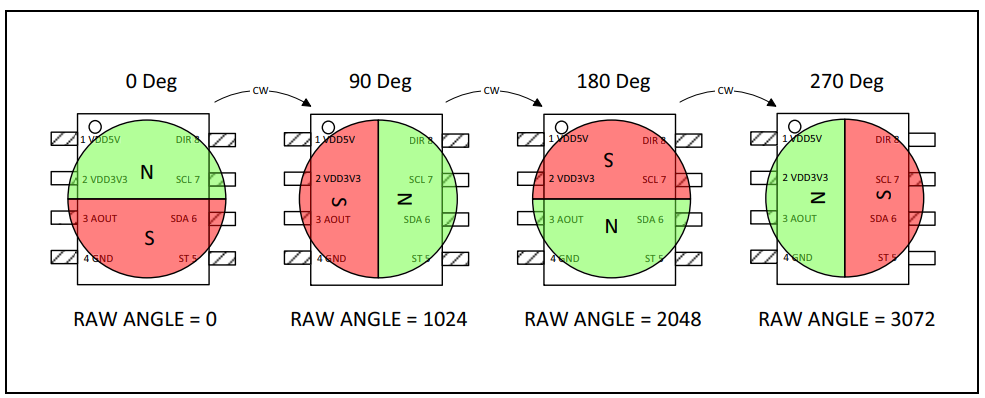

# Usage of the drivers

Here a brief tutorial to use the libraries in other projects and configure correctly:

## Driver Structure

```
my_project/

├── CMakeLists.txt                      # main CMake file of the project 

├── sdkconfig                           # Configuration generated by `menuconfig`

├── main/

│   ├── CMakeLists.txt                  # project Cmake file.

│   ├── main.c                          # main file of the project

└── sensor_driver/                      # driver folder

    ├── sensor_driver.c                 # Iimplementation of the folder

    └── include/                        # header files folder
        
        ├── sensor_driver.h             # header file
        
        └── driver_config.h             # optional configuration of the driver
    

```

## Basic configuration of the `main/CMakeLists.txt`

The following code shows how to corretly configure the CMakeLists file for the proper use of the structure of the drivers presented previously


```c
file (GLOB SRC_FILES "../sensor_driver/*.c")

idf_component_register(
        SRCS "main.c" ${SRC_FILES}
        INCLUDE_DIRS "." "../sensor_driver/include"
)

``` 
---

## 📌 Table of Contents  
- [Overview](#overview)  
- [Key Hardware Peripherals](#key-hardware-peripherals)  
  - [Encoder: AS5600](#encoder-as5600)  
  - [Speed Controller: HobbyWing SkyWalker 60A](#speed-controller-hobbywing-skywalker-60a)  
  - [IMU: TransducerM TM151 (9-axis AHRS)](#imu-transducerm-tm151-9-axis-ahrs)  
---

## Overview  
This firmware implements the core functionality of the SEA Striker robot: sensor acquisition (encoders, IMU), actuator control (BLDC motors via ESCs), motion control (PID loops), and communications (UDP, WiFi). The architecture is modular and designed for concurrency under FreeRTOS on the ESP32 S3. The code is organized in libraries to abstract platform-specific peripherals (I²C, ADC, PWM, GPIO) and individual device drivers, plus higher-level control and task scheduling.  

---

## Key Hardware Peripherals  

### Encoder: AS5600  

| Parameter | Specification |
|-----------|-------------|
| Device | AS5600 – 12-bit programmable contactless magnetic rotary position sensor. |
| Output modes | 12-bit analog voltage or PWM or I²C raw angle. |
| Angular resolution | 12-bit → 4096 positions/rotation. |
| Supply voltage | 3.3 V or 5 V compatible. |
| Operating temperature | –40 °C to +125 °C.|
| Interface | I²C (address 0x36 default) plus optional PWM/Analog. |
| Key features | Contactless measurement, no mechanical wear, programmable start/stop angle, direction pin (DIR) controls increasing or decreasing angle.  |

The following image shows the Raw Angle in Clockwise Direction according to the magnet position


For more details see the [Encoder AS5600 Datasheet](https://files.seeedstudio.com/wiki/Grove-12-bit-Magnetic-Rotary-Position-Sensor-AS5600/res/Magnetic%20Rotary%20Position%20Sensor%20AS5600%20Datasheet.pdf)

**Usage in this project**: Configured for analog output mode (for this robot). Hysteresis set to 2 LSB to avoid jitter when the wheel is stationary. Output analog range from 10% to 90% of VCC. 
It can be configured and calibrated through the I²C interface when operating in configuration mode.

---

### Speed Controller: HobbyWing SkyWalker 60A  
| Parameter | Specification |
|-----------|-------------|
| Device | SkyWalker 60A ESC – Brushless motor speed controller.  |
| Continuous current | 60 A (burst up to ~80 A for short periods) for the 60A UBEC variant.  |
| Input voltage (battery) | 2–6 S LiPo (for 60A UBEC version) or 3–6S depending on variant.  |
| BEC output | Switch-mode 5 V @ 5 A (UBEC version). |
| Max motor RPM (2-pole motor) | Up to ~210 000 rpm (2-pole) depending on variant. |
| Dimensions / Weight | Approximately 77 × 35 × 14 mm, ~63 g (for 60A UBEC).  |
| Features | Advanced 32-bit MCU (with a running frequency of up to 96MHz) for motor control, multiple protections (low voltage, thermal, throttle signal loss), programmable via transmitter/LED box.  |
| Programable Items | Brake Type, Brake Force, Voltage Cutoff Type, LiPo Cells, Start-up Mode, Timing, Active Freewheeling, Search Mode |

For more information about the configuration and sounds review the [ESC Datasheet](https://www.hobbywing.com/en/uploads/file/20230321/69381b562c41439ee4451c7152905f10.pdf)


**Usage in this project**: Two speed controllers are used for drive wheels. They are configured for “reverse displacement” (inversion of direction), and provide regulated 5 V output for the microcontroller. PWM outputs from MCU (via MCPWM) control motor speed and direction.

---

### IMU: TransducerM TM151 (9-axis AHRS)  
| Parameter | Specification |
|-----------|-------------|
| Device | TM151 IMU – 9-axis (accelerometer + gyroscope + magnetometer) attitude and heading reference system. |
| Output | Roll, pitch, yaw, quaternions; raw accelerations/gyro/magnetometer.  |
| Typical gyroscope range | ±1000°/s (typical) for this model.  |
| Output update rate | Up to ~400 Hz (configurable) for orientation output. |
| Power & interface | Compatible with 3.3/5 V, interface UART (TTL) or USB-C (VCP).  |
| Yaw drift | Approx. ~3° every 25 minutes under flat conditions (yaw drift spec).  |

For more details see [TM151 Information](https://www.syd-dynamics.com/transducerm_tm151-tm171/)

**Usage in this project**: Intended for sensor fusion (together with encoders and lidar) to estimate robot orientation and velocity. At present, the sensor-fusion module remains in a preliminary state (many functions inactive), but the IMU driver is available.

---