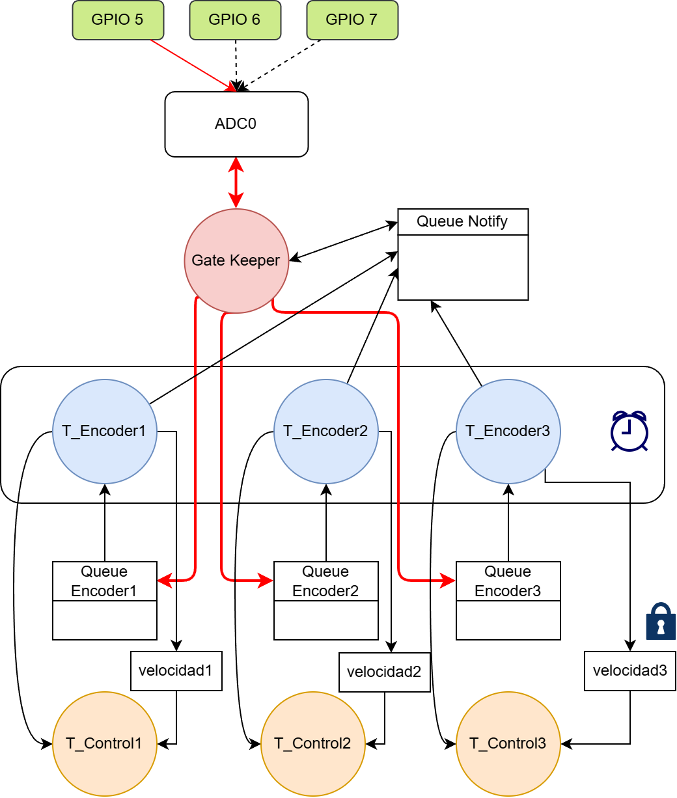

# Advanced Embedded Systems ⚙️
The best course in Electronic Engineering has its own repository. Here you'll find a well-organized collection of sensor drivers and some programs developed throughout the course. This project houses a collection of sensor drivers and firmware developed during the course, aimed at controlling and interfacing with various embedded sensors and actuators, specifically focused on robotics.

## Project Overview 📝

This repository includes multiple laboratories focused on different aspects of embedded systems, from sensor driver development to robot motion control. Our work has been evolving through various stages, and we’re continuously working on improving and adding new features to make the system more robust, efficient, and adaptable.

---

## Current Implementation ⚡️

### LAB 1 - [C Libraries](./C%20libraries/) 🛠️

**Overview**:  
The first lab focuses on creating hardware abstraction layers for several sensors. These sensors are used in the subsequent labs for the robot’s motion and environmental awareness.

**Sensors and Devices**:  
- AS5600 Magnetic Encoder
- VL53L1X Long Range LiDAR
- VL6180X Short Range LiDAR
- APD9960 RGB Sensor
- TM151 9-axis IMU

**Features**:
- Hardware Abstraction Layer (HAL) for seamless integration with different microcontrollers.
- Designed for easy porting to different platforms; currently tested with ESP32-S3.

---

### LAB 2 - [One-Wheel Movement](./wheel-movement/) 🚗

**Overview**:  
The goal of this lab is to control the movement of a single wheel using sensor data for feedback and control.

**Implemented Features**:
- **Velocity control** using an incremental PID controller.
- **Distance control** using encoder arc estimation.
- **UART Interface Commands** to modify control parameters and system behavior, such as:
  - ```P <proportional> <integral> <derivative> <set_point>```
  - ```X <new_pwm>``` (sets PWM duty cycle to control speed)
  - ```S <new_set_point>``` (changes PID set point)
  - ```D<distance>_<velocity>``` (sets right displacement with velocity goal)
  - ```I<distance>_<velocity>``` (sets left displacement with velocity goal)

---

### LAB 3 - [Robot Movement](./robot-mov/) 🤖 (**in progress**)

**Overview**:  
This lab integrates multiple sensors and actuators to move a 3-wheeled robot, expanding on the previous lab’s one-wheel setup.

**Current Features**:
- **Independent velocity control** for each wheel using an incremental PID controller.
- **System model** for controlling robot position and velocity.
- **WiFi interface commands** for more complex motion, such as:
  - Linear displacement (forward/backward at a specified velocity and angle).
  - In-place rotation (clockwise/counterclockwise with specified degrees and velocity).
  - Circular displacement (with a specified radius, direction, velocity, and degrees).

---

## Planned Improvements 🚀

### 1. **Task Synchronization Using Kernel Objects** 🔄  
We will introduce a more efficient task synchronization method using kernel objects to coordinate between tasks:
- **Timers**: A timer (ESP_Timmer) will trigger sensor read tasks every 2ms using an ISR with `xTaskNotifyFromISR()`. The encoder readings will be queued for further processing.
- **Sensor Communication**: Tasks will communicate via queues and event groups. Specifically, the distance measurement task will only execute when new readings are available from all encoders.

### 2. **New Task Creation** 🔧  
To decouple the control logic and actuator handling, new tasks will be created for each wheel:
- These tasks will adjust the PWM and wheel direction as requested by the control task.
- Communication between control and actuator tasks will be managed via queues, ensuring smooth operation and flexibility.

### 3. **Peripheral Enhancements** 🌐  
We aim to improve the **IMU sensor integration**, which has faced limitations in previous iterations. Specifically, we’ll enhance the sensor fusion algorithm to incorporate IMU readings more effectively for better movement control and orientation tracking.

### 4. **Code Refactor & Documentation 📝**  
- **Refactoring**: The main codebase contains several repetitive code blocks, indicating the need for functions to modularize tasks. We will review and refactor these sections to improve maintainability and reduce redundancy.
- **Build Optimization**: We will introduce separate compilation directives for each source file to allow modular building and easier updates.

The following diagram illustrates the proposed task synchronization scheme, which introduces a gatekeeper mechanism for ADC readings.A periodic timer with a 2 ms interval triggers each encoder task, which then sends a notification to a queue when it requires an ADC measurement. The gatekeeper task processes these requests sequentially, performs the corresponding ADC reading, and sends the result back to the encoder’s queue. Once the encoder task receives the ADC value, it computes the wheel velocity and subsequently notifies its respective control task.


---

## Getting Started 🏁

Here, we will guide you through the steps to get up and running with this repository.

### Steps to Set Up Your Hardware ⚙️

1. **Setup Speed Controlers**
2. **Burn Encoders Registers**
